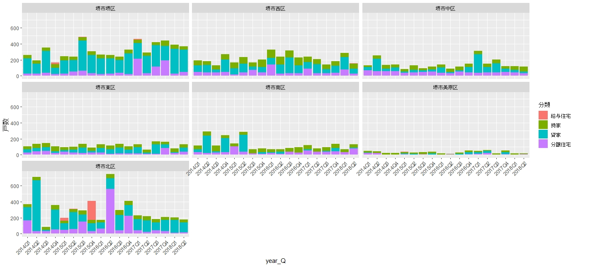

#  複数のエクセルファイルを読み込み、必要なデータを抽出、グラフ化

## データの入手方法
e-stat(政府統計の総合窓口)から、「建築着工統計調査」「住宅着工統計」「月次」とすすみ、ここでは市区町村ごと月次着工戸数を入手。後記のグラフでは、H26年1月～H30年7月の17番めの2601b017.xls～3007b017.xlsの54ファイルをを１つのフォルダにおく（ダウンロードするのが面倒です・・・)。
全国データですが、ここでは大阪府下のデータのみを抽出。

## 利用方法等
エクセル加工用のデータ（CSVファイル)を作成。

グラフ化の例として、堺市の区毎のグラフを表示。

